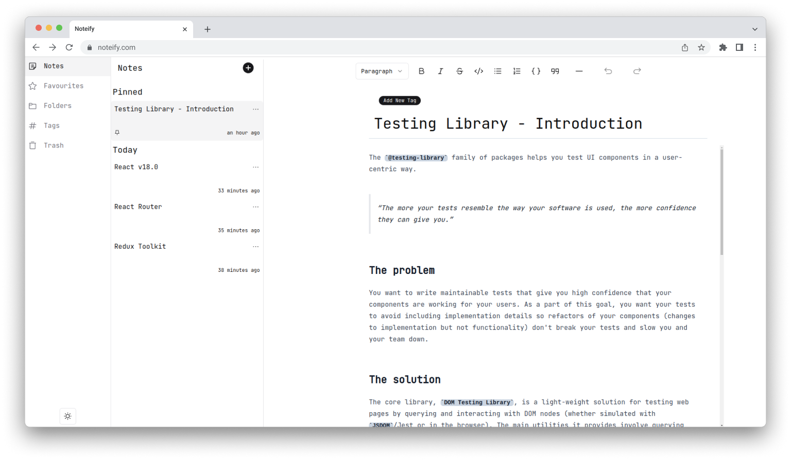
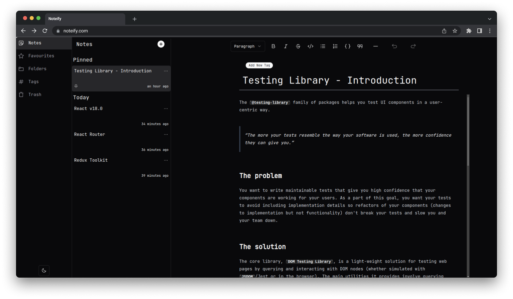

# Noteify


A Local note taking app that has beautiful UI and an easy to use interface, that saves your notes in your browser for fast access.

## Preview 

 


## Features
- [x] Create and edit notes
- [x] Delete notes
- [x] Pin your important notes
- [x] Favourite notes
- [x] Tag your notes
- [x] Save your notes into folders
- [x] Trash your notes
- [x] Permanently delete your notes
- [x] Dark mode
- [ ] Search your notes
- [ ] Share your notes 
- [ ] Export your notes
- [ ] Add links to your notes
- [ ] Add images to your notes
- [ ] Add tables to your notes

## Stack

- Vite & React 
- Shadcn-ui
- Redux
- Localforage
- Vitest & Testing-Library


## How to use
You can visit [Noteify](https://noteify-three.vercel.app/) or you can clone it and use it as a template.

```bash
git clone https://github.com/agn/Noteify
cd Noteify
npm install
npm run dev
```


## Contributing 
The website is missing lot of features. If you want to contribute, please [open an issue](https://github.com/agn/Noteify/issues) or [create a pull request](https://github.com/agn/Noteify/pulls).